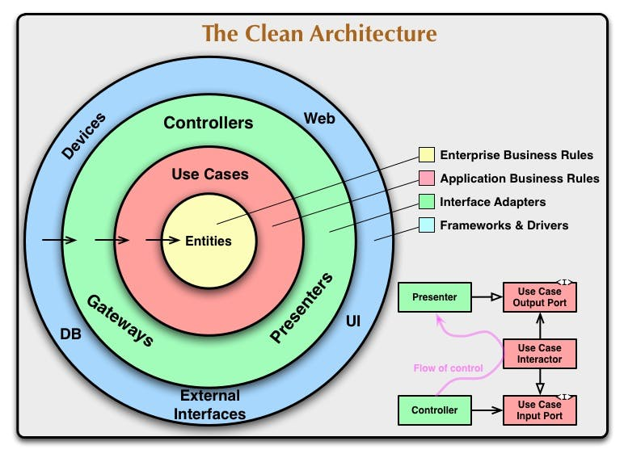

# My clean architecture
---
### Who are you

- @shunjikonishi
- Freelance Engineer
  - Mainly backend, sometime work on frontend, infra.
- Language: Scala, Typescript, Go, Ruby, etc

---
### Today's content
- Something **like** clean-architecture
  - How to apply clean architecture to product.
  - I've arranged some concept at that time.
  - It is not same as original

---
### What is clean architecture


---
### Point
- The center is business rules.
- Application rules are around that.
- Controllers and Presenters are around that
- **Database, External Services(e.g. Redis) are most outside.**
- Dependencies are one way. 
  - Outer range can depends on inner things
  - But inner range can not depends on outer things.

---
### Database, External Services are most outside.
- Interesting point for me
- If it is simple technology stack, DB, redis etc may be center(or bottom)
- But clean architecture put them to most outside.
- So, we need something like `interface` to implement it.

---
### Main directories
- domain
- usecase
- controller
- repository
- interfaces
- presenter
- external

---
### domain
- It is `Entities` layer
- The other word. It is model.
- It has only models and some calculation.
- Don't have CRUD for models
  - CRUD are usecase

---
### usecase
- It is `Usecases` layer
- Business logic
- All usecases has executor parameter.
- All usescases has input and output.
- Usecase can return error.

Basic usecase
```
trait Usecase[IN, OUT] {
  def run(executor: User, input IN): Either[Error, OUT]
}
```

Details are later.

---
### controller
- It is `Controllers` layer
- This is entry point for application.
- It depends on web framework
  - NodeJS -> Express
  - Scala -> Playframework
- Validation for input **values** are done here.
  - e.g. `Age` field should be positive interger.
  - e.g. `Status` field should be one of enum values.
- Validation for business logic are not here.
  - e.g. Specified enitity exists and the user has permission for it.

---
### repository
- It is `External interfaces` layer
- Mainly it is database.
- Mainly it has simple CRUD methods.
- Don't include buisness logic.
  - e.g. `Delete` method should not check permission
- It is not MUST thing to check foreign keys.
  - However it can be error, if it has invalid relation.

---
### interfaces
- It is `Usecases` layer
- Interfaces for repositories

---
### presenter
- It is `Presenter` layer
- It defines output format for domain objects.
  - e.g. The domain object `User` has password field.
  - But it should be hidden in output format
  - e.g. If the user doesn't have enough permission, some fields should be hidden.
- Problem.
  - It is easy to use wrong presenter.

---
### external
- It is `External interfaces` layer
- Redis, external web services etc.
- It reqires `interfaces`
  - Because `Usecases` layer can not depends on it.

---
## More detail for usecases

---
### 1 file for 1 usecase
- All usecases should be simple enough
- We make a file for every usecases.

---
### usecase has executor and input and output
Basic usecase
```
trait Usecase[IN, OUT] {
  def run(executor: User, input IN): Either[Error, OUT]
}
```

IN and OUT can be multiple

---
### Permission check is independent usecase
- Basically usecase doesn't have permission check.
- e.g. Add new employees tp a Company.
  - This usecase is allowed for only admin user.
  - But not check admin role in usecase

---
### We can combine multiple usecases
- We can use multiple usecases in controller
- First usecase output can be next usecase input

---
### Search is out of clean architecture
- Clean Architecture is good for simple actions.
- However it is not good for complex search.
- We can ignore Clean Architecture for complex search.
  - CQRS is useful concept

---
### Summary
- Clean Architecture is not something new
  - Most concepts are simple and traditional
- It can keep application simple.
- **We can avoid consider different layer at the same time**
