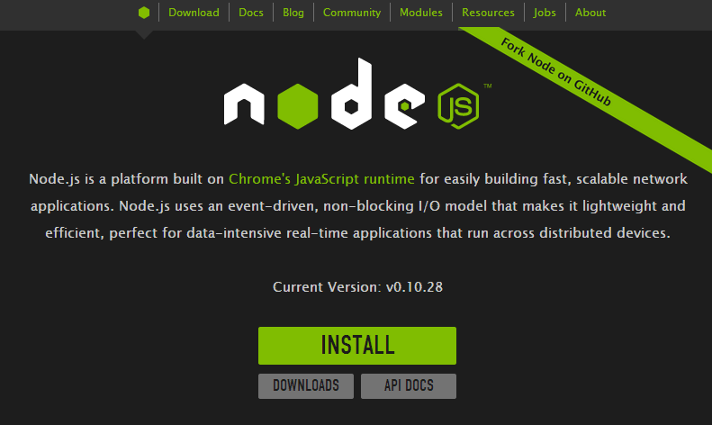

#Grunt超入門
---
###この文書の目的
- とりあえずGrunt使えるようになっとこうか
- 世間ではGrunt, Bower, Yeomanが3点セットのように言われているがそれはまたおいおい

---
### Gruntとは
http://gruntjs.com/


- JavaScript Task Runner(node.js版のANT)
- 軽い
- ファイル監視のwatchタスクが*超絶便利*
  
---
### node.jsとは
- V8をエンジンとしたJavaScript実行環境
- 「node」と「npm」コマンドが含まれている
  - nodeはjsの実行コマンド(REPLもあり)
  - npmはnode用のパッケージマネージャ

---
### node.jsインストール
http://nodejs.org/


---
### npmの使い方
- init, install, uninstall, list以外のコマンドを使ったことがない
  - npm init: package.jsonの生成
  - npm install: パッケージのインストール
  - npm uninstall: パッケージのアンインストール
  - npm list: インストールされたパッケージの一覧表示
***
- install, uninstall, listはオプションとして「-g」をつけるとグローバル(OSユーザーフォルダ)が対象となり、付けない場合はカレントフォルダが対象となる
- カレントフォルダにパッケージをインストールした場合は「node_modules」というフォルダが生成されてそこに保存される

---
### grunt-cliをインストール
- 前準備としてgrunt-cliをグローバルインストール
``` bash
npm install -g grunt-cli
```
- 原則としてgrunt関連のパッケージでグローバルインストールするのはgrunt-cliのみでそれ以外はローカルインストールする

---
### プロジェクトへのGruntの組み込み
- 既存プロジェクトのルートでnpm initを実行してpackage.jsonを作成する
  - 対話形式で名前やバージョン等を聞かれるので適当に入力
  - package.jsonは単なるJSONテキストなので生成後に自由に変更可
- Gruntと使用するタスクを*「--save-dev」*をつけて*ローカルインストール*する
``` bash
npm install --save-dev grunt
npm install --save-dev grunt-contrib-jshint
npm install --save-dev grunt-contrib-uglify
npm install --save-dev grunt-contrib-watch
```
- 標準タスクはたいてい「grunt-contrib-xxxx」という名前

---
### 「--save-dev」って何？
- このオプションを付けるとインストールと同時に*package.jsonの「devDependencies」にパッケージ情報を追加*してくれる
- package.jsonに依存性情報が書かれている場合引数なしで「npm install」を実行することですべてのパッケージをインストールしてくれる
- ちなみに「--save」とすると「devDependencies」ではなく、「dependencies」に追加されるが、こちらはnode.jsアプリを作成する場合に使用するものなのでGruntを使いたいだけの場合は使用しない
  - もちろん後からpackage.jsonを直接編集しても良い
  
---
### 何でローカルインストール？
- gruntとかgrunt-contrib-watchは毎回使うからグローバルインストールで良いのでは？と思うかもしれないが。。。
  - とにかく*バージョンアップが早い*ので数カ月もすると互換性の問題がでたり
  - 自分の環境でグローバルにあっても人の環境にもあるとは限らない
  - package.jsonでの依存性管理の恩恵が薄れる
- Grunt関係でグローバルインストールが許されるのは「grunt-cli」のみ
> Javaでossのライブラリを共通クラスパス配下に置かないのと同じこと

---
### Gruntfile.jsの作成
- プロジェクトのルートフォルダにGruntfile.jsを作成する
- 最低限のベーステンプレートは以下

``` javascript
module.exports = function(grunt) {
    grunt.initConfig({
        //package.jsonのロード(必須ではない)
        pkg: grunt.file.readJSON('package.json'),
        //タスクの設定
    });
    // プラグインのロード
    //grunt.loadNpmTasks('grunt-contrib-xxxx');
    // デフォルトタスクの設定
    grunt.registerTask('default', []);
};
```
- initConfig以下でタスクを定義
- 使用するタスクをgrunt.loadNpmTaskでロード
- 引数なしで実行するタスクを「default」というキーで登録

---
### タスク定義の例
``` javascript
concat: {
    page1 : {
        src : [
            "app/scripts/page1.feature1.js",
            "app/scripts/page1.feature2.js",
            "app/scripts/page1.feature3.js"
        ],
        dest: "public/javascripts/page1.js"
    },
    page2 : {
        src : [
            "app/scripts/page2.feature1.js",
            "app/scripts/page1.feature2.js"
        ],
        dest: "public/javascripts/page2.js"
    }
},

uglify: {
    build: {
        files: [{
            "public/javascripts/page1.js": "public/javascripts/page1.min.js",
            "public/javascripts/page2.js": "public/javascripts/page2.min.js"
        }]
    }
},
```
- トップレベルはタスク種別
- 次段は任意の名前
- それ以下はタスク定義内容
- 実例) [QuizarのGruntfile](https://github.com/shunjikonishi/ws-quiz/blob/master/Gruntfile.js)

---
### タスクの実行方法
- デフォルトタスクの実行
``` bash
grunt
```
- タスク単位で実行
``` bash
grunt concat
```
- 個別タスクを実行
``` bash
grunt concat:page1
```
- watch(CTRL+Cで停止)
``` bash
grunt watch
```
---
### タスクの種類
- http://gruntjs.com/plugins に3000個近くリストされている(ダウンロード回数順)
- 個人的に良く使うのは以下

|タスク名|説明|
|---|---|
|grunt-contrib-concat|ファイル連結|
|grunt-contrib-copy|ファイルコピー|
|grunt-contrib-uglify|JavaScriptのminify|
|grunt-contrib-jshint|JavaScript構文チェック|
|grunt-contrib-watch|ファイル変更監視|
                                                                            
---
### タスクの記述方法
- ググッテ、
- コピッテ、
- チョットナオス
***
- 。。。が、とにかくバージョンアップが早いので内容が古いケースが多々ある。 
- 必ず一度はGitHubのREADMEを確認すること。
- *検索ヒット率の高いタスクでもdeprecated*となっていることも多い。

---
### grunt watchでファイル監視
- この為だけにGruntを使っていると言っても過言ではない
- 以下は実際に使用している定義

``` javascript
watch: {
    scripts: {
        files: ['app/scripts/*.js'],
        tasks: ['jshint', 'concat', 'uglify']
    },
    app: {
        files: ['app/**/*'],
        tasks: [],
        options: {
            livereload: true
        }
    }
}
```
- js変更時に構文チェック、連結、Minify
- app以下のファイル変更時にLive Reload

---
### LiveReload
- ブラウザにLiveReloadプラグインを入れる
  - 少なくともChromeとFirefoxにはプラグインがある
  - ブラウザにGruntからリロードしてね、と通知が行くだけ
  - LiveReloadしたいタブで有効化(localhost以外を表示中は有効にならないっぽい)
- HTML内にLiveReload用のscriptタグを挿入する方法もあるが使ったことがない
  - というか開発時にのみ必要となる機能をscriptタグで差し込むべきではない

---
### さらに進んだ使い方
- Gruntfile.jsは普通のJavaScriptなので好きなようにカスタマイズできる
- 例)package.jsonから自動的にloadNpmTasksする

``` javascript
function loadDependencies(deps) {
    for (var key in deps) {
        if (key.indexOf("grunt-") == 0) {
            grunt.loadNpmTasks(key);
        }
    }
}
grunt.initConfig({
    ...
});
loadDependencies(grunt.config("pkg").devDependencies);
```

---
### プロジェクト独自のタスク定義
- http://gruntjs.com/creating-tasks から引用

``` javascript
grunt.registerTask('foo', 'A sample task that logs stuff.', function(arg1, arg2) {
  if (arguments.length === 0) {
    grunt.log.writeln(this.name + ", no args");
  } else {
    grunt.log.writeln(this.name + ", " + arg1 + " " + arg2);
  }
});
```
- 条件によって動的にタスクを変更することも可能
- 実行コマンド  
  - 引数は「:」区切りで指定

``` bash
grunt foo
foo, no args

grunt foo:hoge:fuga
foo, hoge fuga
```
---
### Gitで使う場合
- node_modulesフォルダを .gitignoreに追加
- Gruntを使うだけなら実はpackage.jsonは必須ではないが依存性を管理するために必ず作成する
- clone後に「grunt install」とするだけで環境が整う

---
### Herokuで使う場合
- package.jsonがあるとnode.jsアプリと判定されるため、Play等と併用する場合は*環境変数でBUILDPACK_URLを明示*する必要がある
- buildpackではGruntタスクは実行されないため、連結、MinifyしたファイルもGit管理する
  - 時間が取れたらbuildpack-multiと併用して、build時にGruntタスクを実行するbuildpackを作りたいと思っている

---
### SublimeText
- プラグインでSublimeText上からGruntを実行できる
- https://github.com/tvooo/sublime-grunt
  - CTRL+SHIFT+Pからgruntを選択して実行
  - grunt watchの経過はBuild Resultに表示される
  - ESCで非表示
  - Tools > Build Results > Show BuildResults で再表示

