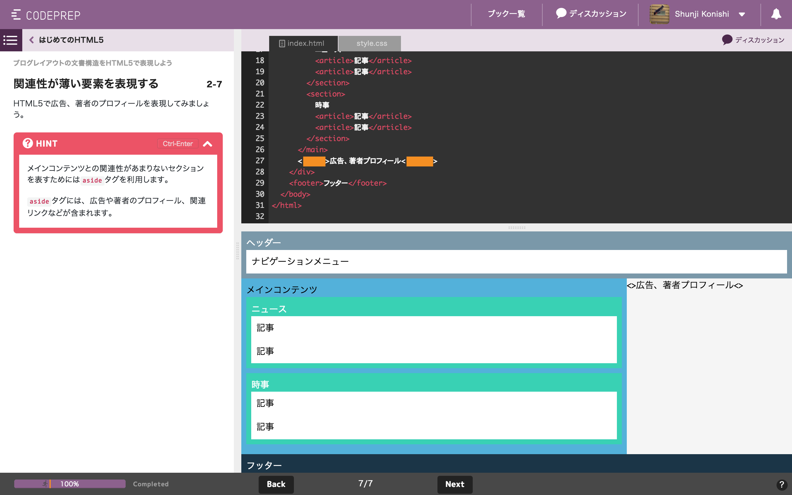

# はじめての Rust
---
### Who are you

- @shunjikonishi
- 株式会社 Givery エンジニア
  - Services: CODEPREP, codecheck
- 使用言語: Scala, Java, JS, TypeScript
- Rust歴: 3ヶ月
  - Rust Meetup参加2回目

---
### CODEPREP
- https://codeprep.jp

-->

---
### RustのBook
- これまでに3冊のRust Bookをリリース

---
### 書いた人

---
### はじめてのRust

# 翻訳

---
### Rustブックの中身

---
### アメリカンジョーク

- 卵をご飯に、ベーコンを魚に置換する

---
### ブックリリース履歴
- **毎週水曜日に2〜3冊をリリース**
- 本日リリース
  - Rubyのクラスを理解する
  - HTMLとCSS3で作るパンくず
- Rustブック
  - 5/3  初めてのRust(前編)
  - 5/24 初めてのRust(後編)
  - 6/7  Rustの特徴を理解する 所有権編
  - 次の予定はない <!-- .element: class="fragment" data-fragment-index="1" -->
---
### 何故なら読まれてないから。。。
- 一番人気のブック(HTML5)のx0分の1以下
- Scalaも似たようなもの。。。
  - (今週はScalaの方がちょっと人気)
- 初心者向けのサイトとして紹介されることが多いため仕方のない側面もあるがCODEPREPが価値を提供する対象は決して初心者のみではない。

---
### 大事なこと
<ul>
  <li>今後Rustブックを増やすためには</li>
  <ul>
    <li class="fragment" data-fragment-index="1">ReadCountを増やす</li>
    <li class="fragment" data-fragment-index="2">Twitterで~~圧力をかける~~拡散する</li>
  </ul>
  <li class="fragment" data-fragment-index="3">**なんなら書いてくれる人募集**</li>
  <li class="fragment" data-fragment-index="4">Scalaもよろしくお願いします。</li>
</ul>

-->
## 無料で読めるのは 今だけです！
