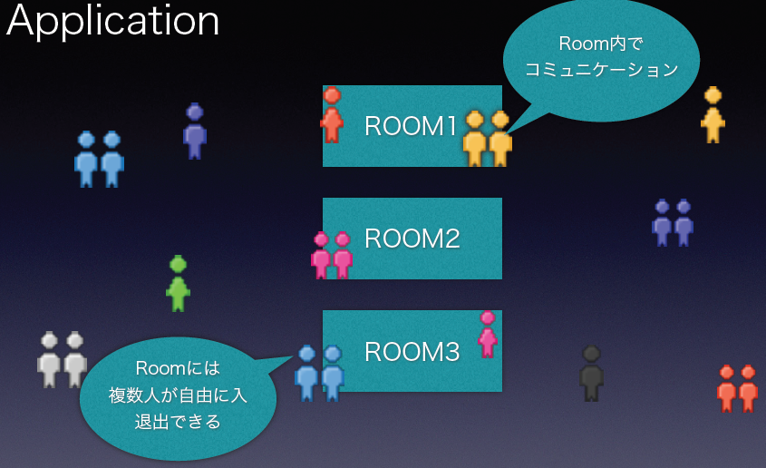

###Herokuで作る<br>WebSocketアプリケーション
2014年6月9日  
株式会社 FLECT  
小西俊司
---
### Who?
- 氏名: 小西俊司
- 所属： [株式会社 FLECT](http://www.flect.co.jp/) クラウド事業部
  - [OSS Library](http://oss.flect.co.jp/)
- Twitter: [@shunjikonishi](https://twitter.com/shunjikonishi)
- GitHub: [shunjikonishi](https://github.com/shunjikonishi)

---
### Agenda
- WebSocketアプリサンプル
- WebSocketの通信パターン
- WebSocketとセキュリティ
- 切断のパターンと対処
- HerokuとWebSocket
  
---
### WebSocketアプリサンプル

---
### お絵描きツール
- [GitHub.ioにあるデモ](http://shunjikonishi.github.io/room-sandbox/sample/canvas.html)
- ひとつのCanvasに皆でお絵描き

<div>
  <div>
    <canvas id="pad2" height="200"></canvas> 
  </div>
  <div>
    <button id="btnClear" class="btn">Clear canvas</button>
  </div>
</div>

※スケールが変わっているためこの画面ではマウスの位置と描画がずれることがあります。
---
### Quizar
- http://quizar.info/
- ルーム内に出題者と回答者がいるクイズゲーム

<div id="quizar-video"></div>

---
### このプレゼン
- Sender: スマホ。 スワイプ等のイベントを送信
- Receiver: PC。 イベントに反応してページをめくる


---
### ルームモデル
- WebSocketアプリの典型的なモデル
- 同じ部屋に複数のクライアントが存在して何らかのコラボレーションを行うモデル
- 各クライアントのロールは同じとは限らない



---
### WebSocket通信のパターン

---
### ブロードキャスト
<div id="broadcast-src" style="display:none"> 
Client A->Server A:Message
Server A->Room:Broadcast
Room->Server B:Broadcast
Server B->Client B:Message
</div> 
<div id="broadcast" class="sequence" style="background: #ffffff;"> 
</div> 

---
### npm install
- 前準備としてgrunt-cliをグローバルインストール
``` bash
npm install -g grunt-cli
```
- 原則としてgrunt関連のパッケージでグローバルインストールするのはgrunt-cliのみでそれ以外はローカルインストールする

---
### プロジェクトへのGruntの組み込み
- 既存プロジェクトのルートでnpm initを実行してpackage.jsonを作成する
  - 対話形式で名前やバージョン等を聞かれるので適当に入力
  - package.jsonは単なるJSONテキストなので生成後に自由に変更可
- Gruntと使用するタスクを*「--save-dev」*をつけて*ローカルインストール*する
``` bash
npm install --save-dev grunt
npm install --save-dev grunt-contrib-jshint
npm install --save-dev grunt-contrib-uglify
npm install --save-dev grunt-contrib-watch
```
- 標準タスクはたいてい「grunt-contrib-xxxx」という名前

---
### 「--save-dev」って何？
- このオプションを付けるとインストールと同時にpackage.jsonの「devDependencies」にパッケージ情報を追加してくれる
- package.jsonに依存性情報が書かれている場合引数なしで「npm install」を実行することですべてのパッケージをインストールしてくれる
- 「--save」とすると「devDependencies」ではなく、「dependencies」に追加されるが、こちらはnode.jsアプリを作成する場合に使用するものなのでGruntを使いたいだけの場合は使用しない
  - もちろん後からpackage.jsonを直接編集しても良い
  
---
### 何でローカルインストール？
- gruntとかgrunt-contrib-watchは毎回使うからグローバルインストールで良いのでは？と思うかもしれないが。。。
  - とにかくバージョンアップが早いので数カ月もすると互換性の問題がでたり
  - 自分の環境でグローバルにあっても人の環境にもあるとは限らない
  - package.jsonでの依存性管理の恩恵が薄れる
- Grunt関係でグローバルインストールが許されるのは「grunt-cli」のみ
> Javaでossのライブラリを共通クラスパス配下に置かないのと同じこと

---
### Gruntfile.jsの作成
- プロジェクトのルートフォルダにGruntfile.jsを作成する
- 最低限のベーステンプレートは以下

``` javascript
module.exports = function(grunt) {
    grunt.initConfig({
        pkg: grunt.file.readJSON('package.json'),
        //タスクの設定
    });
    // プラグインのロード
    //grunt.loadNpmTasks('grunt-contrib-xxxx');
    // デフォルトタスクの設定
    grunt.registerTask('default', []);
};
```
- initConfig以下でタスクを定義
- 使用するタスクをgrunt.loadNpmTaskでロード
- 引数なしで実行するタスクを「default」というキーで登録

---
### タスク定義の例
``` javascript
concat: {
    page1 : {
        src : [
            "app/scripts/page1.feature1.js",
            "app/scripts/page1.feature2.js",
            "app/scripts/page1.feature3.js"
        ],
        dest: "public/javascripts/page1.js"
    },
    page2 : {
        src : [
            "app/scripts/page2.feature1.js",
            "app/scripts/page1.feature2.js"
        ],
        dest: "public/javascripts/page2.js"
    }
},

uglify: {
    build: {
        files: [{
            "public/javascripts/page1.js": "public/javascripts/page1.min.js",
            "public/javascripts/page2.js": "public/javascripts/page2.min.js"
        }]
    }
},
```
- トップレベルはタスク種別
- 次段は任意の名前
- それ以下はタスク定義内容
- 実例) [QuizarのGruntfile](https://github.com/shunjikonishi/ws-quiz/blob/master/Gruntfile.js)

---
### タスクの実行方法
- デフォルトタスクの実行
``` bash
grunt
```
- タスク単位で実行
``` bash
grunt concat
```
- 個別タスクを実行
``` bash
grunt concat:page1
```
- watch(CTRL+Cで停止)
``` bash
grunt watch
```
---
### タスクの種類
- http://gruntjs.com/plugins に3000個近くリストされている(ダウンロード回数順)
- 個人的に良く使うのは以下

|タスク名|説明|
|---|---|
|grunt-contrib-concat|ファイル連結|
|grunt-contrib-copy|ファイルコピー|
|grunt-contrib-uglify|JavaScriptのminify|
|grunt-contrib-jshint|JavaScript構文チェック|
|grunt-contrib-watch|ファイル変更監視|
                                                                            
---
### タスクの記述方法
- ググッテ、
- コピッテ、
- チョットナオス
***
- 。。。が、とにかくバージョンアップが早いので内容が古いケースが多々ある。 
- 必ず一度はGitHubのREADMEを確認すること。
- ヒット率の高いタスクでも*deprecated*となっていることも多い。

---
### grunt watchでファイル監視
- この為だけにGruntを使っていると言っても過言ではない
- 以下は実際に使用している定義

``` javascript
watch: {
    scripts: {
        files: ['app/scripts/*.js'],
        tasks: ['jshint', 'concat', 'uglify']
    },
    app: {
        files: ['app/**/*'],
        tasks: [],
        options: {
            livereload: true
        }
    }
}
```
- js変更時に構文チェック、連結、Minify
- app以下のファイル変更時にLive Reload

---
### LiveReload
- ブラウザにLiveReloadプラグインを入れる
  - 少なくともChromeとFirefoxにはプラグインがある
  - ブラウザにGruntからリロードしてね、と通知が行くだけ
  - LiveReloadしたいタブで有効化(localhost以外を表示中は有効にならないっぽい)
- HTML内にLiveReload用のscriptタグを挿入する方法もあるが使ったことがない
  - というか使うべきではない

---
### さらに進んだ使い方
- Gruntfile.jsは普通のJavaScriptなので好きなようにカスタマイズできる
- 例)package.jsonから自動的にloadNpmTasksする

``` javascript
function loadDependencies(deps) {
    for (var key in deps) {
        if (key.indexOf("grunt-") == 0) {
            grunt.loadNpmTasks(key);
        }
    }
}
grunt.initConfig({
    ...
});
loadDependencies(grunt.config("pkg").devDependencies);
```

---
### プロジェクト独自のタスク定義
- http://gruntjs.com/creating-tasks から引用

``` javascript
grunt.registerTask('foo', 'A sample task that logs stuff.', function(arg1, arg2) {
  if (arguments.length === 0) {
    grunt.log.writeln(this.name + ", no args");
  } else {
    grunt.log.writeln(this.name + ", " + arg1 + " " + arg2);
  }
});
```
- 実行コマンド  
  - 引数は「:」区切りで指定

``` bash
grunt foo
foo, no args

grunt foo:hoge:fuga
foo, hoge fuga
```
---
### Gitで使う場合
- node_modulesフォルダを .gitignoreに追加
- clone後に「grunt install」とするだけで環境が整う

---
### Herokuで使う場合
- package.jsonがあるとnode.jsアプリと判定されるため、Play等と併用する場合は*環境変数でBUILDPACK_URLを明示*する必要がある
- buildpackではGruntタスクは実行されないため、連結、MinifyしたファイルもGit管理する
  - 時間が取れたらbuildpack-multiと併用して、build時にGruntタスクを実行するbuildpackを作りたいと思っている

---
### SublimeText
- プラグインでSublimeText上からGruntを実行できる
- https://github.com/tvooo/sublime-grunt
  - CTRL+SHIFT+Pからgruntを選択して実行
  - grunt watchの経過はBuild Resultに表示される
  - ESCで非表示
  - Tools > Build Results > Show BuildResults で再表示

