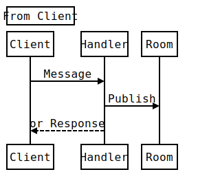
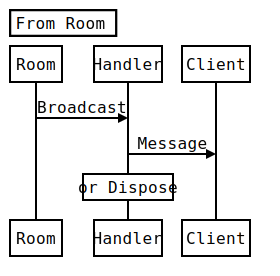

###Herokuで作る<br>WebSocketアプリケーション
2014年6月9日  
株式会社 FLECT  
小西俊司
---
### Who?
- 氏名: 小西俊司
- 所属： [株式会社 FLECT](http://www.flect.co.jp/) クラウド事業部
  - [OSS Library](http://oss.flect.co.jp/)
- Twitter: [@shunjikonishi](https://twitter.com/shunjikonishi)
- GitHub: [shunjikonishi](https://github.com/shunjikonishi)

---
### Agenda
- WebSocketアプリサンプル
- WebSocketの通信パターン
- WebSocketとセキュリティ
- 切断のパターンと対処
  
---
### WebSocketアプリサンプル

---
### [お絵描きツール](http://shunjikonishi.github.io/room-sandbox/sample/canvas.html)
- ひとつのCanvasに皆でお絵描き
- MouseMoveでメッセージ送信
  - メッセージの連投に強いことがわかる

<div>
  <div>
    <canvas id="pad2" height="200"></canvas> 
  </div>
  <div>
    <button id="btnClear" class="btn">Clear canvas</button>
  </div>
</div>

<div class="alert alert-danger">
※スケールが変わるためこの画面ではマウスの位置と描画がずれることがあります。
</div>

-->
### こんなスライドも書きました

[一番簡単なWebSocketの試し方](https://www.slideshare.net/shunjikonishi/websocket-34998961)

<iframe src="http://www.slideshare.net/slideshow/embed_code/34998961" width="427" height="356" frameborder="0" marginwidth="0" marginheight="0" scrolling="no" style="border:1px solid #CCC; border-width:1px 1px 0; margin-bottom:5px; max-width: 100%;"> </iframe> 

---
### Quizar
- http://quizar.info/
- ルーム内に出題者と回答者がいるクイズゲーム

<iframe src="http://www.quizar.info/room/3/ranking" width="560" height="400" frameborder="1"></iframe>

-->
### 紹介ビデオ

<iframe src="//www.youtube.com/embed/tWoEzYr3rps" width="560" height="315" frameborder="0"></iframe>

---
### このプレゼン
- [REVEAL.js](http://lab.hakim.se/reveal-js/)と[remotes.io](http://remotes.io/)のコンボ
- Sender: スマホ。 スワイプ等のイベントを送信
- Receiver: PC。 イベントに反応してページをめくる


---
### ルームモデル
- WebSocketアプリの典型的なモデル
- 同じ部屋に複数のクライアントが存在して何らかのコラボレーションを行うモデル
- 各クライアントのロールは同じとは限らない


---
### WebSocket通信のパターン

---
### 例題
ロールが複数あるアプリのメッセージを考える

- クイズアプリで、
- 出題者、回答者、観覧者がいる状態で、
- 出題者が送信したメッセージを、
- 回答者が受信する

<div class="padTop">
シーケンスを図示せよ
</div>

---
### 解答例
素直に書くと以下のようになる


<div class="padTop">
間違ってないが。。。
</div>

---
### 常に間にルームを置いて考える


- Roomは単純なメッセージブロードキャスト機構
- Serverが単一ホストの場合でも常にルームを介してブロードキャストする
- 送信元の出題者と出題者は同じクライアントだが別のエンティティとして考える

<div class="padTop fragment" data-fragment-index="1">
*このように考えることには2つのメリットがある*
</div>

---
### メリット1: スケールアウト
- 接続数が増えた場合にサーバ台数を増やすことで対応可能となる
  - Herokuの場合はDyno数を増やすだけ
- Room機能はRedisのPub/Subをそのまま利用できる
- 逆にRoom概念が導入されていない場合に後からスケールアウトすることはほとんど不可能

---
### メリット2: シンプル
Roomの右側と左側のシーケンスを別に考えることができる

<div>
  
  
</div>

<div class="padTop">
</div>

- ロールが増えても常にシーケンスは上記のパターンのみ
- それぞれのメッセージ処理はHTTPで慣れ親しんだCall & Response型の処理とほぼ同じ

---
### Ajaxの代替としてのWebSocket
- デメリット
  - WebSocketの送受信メッセージには対応関係がないのでメッセージ内にIDを埋め込んで自分で対応関係を管理する必要がある
  - WebSocket非対応端末がある(IE9以前、Android 4.3以前の標準ブラウザ)
- メリット
  - 高速
  - ステートを維持した連続リクエストが可能(Ex. インクリメンタルサーチ)
  - *セキュリティ上のメリット*

---
### WebSocketとセキュリティ

---
### 一般的なお話
- WebSocketには*Same Origin Policyがない*ためどこからでも繋がる
  - 接続時にOriginヘッダを検証すべき
- WebSocketリクエストにはCookieが付加される
  - Cookieのみを頼りにしたクライアント確認はCSRFと同じ原理の攻撃が可能(CSWSH)
- 通信内容を保護したい場合はwssを使用する

---
### 脱線
WebSocketとXSSのコンボがやばすぎる件

``` javascript
var ws = new WebSocket("ws://...");
ws.onmessage = function(event){
  //WebSocket経由でスクリプトを受信し
  //ajax通信を含む任意のスクリプトが実行できる!
  eval(event.data);
}
$.ajax = function(v) { 
  //jQueryのajaxメソッドを差し替えて
  //正規の通信を行いつつWebSocketにデータを横流し
  ...
}
```

XSS脆弱性はそもそも存在してはならないが、  
WebSocketがあることでリスク激増！

---
### 安全な接続の確立方法
考え方はCSRF対策と同じ

- ws接続を行うHTMLページを返す際にトークンを生成
  - CookieにSessionIdを付与する
  - トークンはSessionIdとひもづけてMemcached等に保存
- ws接続確立時(onopenイベント)でトークンを送信
  - サーバ側でSessionIdとトークンを検証
  - *成功時のレスポンスでは新たに生成したトークンを返して置き換える*
- なんらかの理由で切断があって再接続した場合も同様にonopenでトークンを送信

---
### トークン検証のシーケンス


---
### WebSocket vs. REST
``` javascript
$(document).ready(function() {
  var ws = new WebSocket("wss://...");
  //トークン検証後に任意の処理を記述
  ...
});
```

- WebSocketは通常*クロージャの中で生成される*ためそのインスタンスにはクロージャ外部からはアクセスできない
  - 仮にXSSの脆弱性があったとしても既存のインスタンスにはアクセスできない
  - トークンは検証毎に置き換えるので新たな接続を確立することもできない
  - ということは*検証後のリクエストは常にValid*
- 対してREST APIは常にオープン
  - ステートレスであるがゆえの宿命
  - リクエスト毎の検証が必須

---
### WebSocket APIでの<br>セキュリティチェック
- セッションの検証
  - 接続時に検証すればその後は不要
- Formパラメータの検証
  - クライアント側でチェックしていれば不要
  - ただしクライアント側にバグがある可能性を考慮して行うべき
- CSRFチェック
  - もちろん不要

<div class="alert alert-success" style="font-size:18pt;">
感覚的にはREST APIがpublicメソッドなのに対し、privateメソッドのイメージ
</div>


---
### 切断のパターンとその対処

---
### HerokuとWebSocket
``` bash
heroku labs:enable websockets -a xxxx
```

- WebSocketを使うためにはlabsコマンドで有効化が必要
- 1日に1度以上Dyno再起動があるのでそのタイミングで接続していたクライアントは*切れる*
- 接続確立後も無通信状態が55秒続くと*切れる*
- デプロイや環境変数の変更でもDynoが再起動して*切れる*
- Herokuの良いところはスケールアウトに対応しやすいところ

<div class="padTop fragment">
安定した接続を要求するアプリの場合はHerokuは向かない
</div>

---
### クライアント側の切断要因
- ブラウザ(タブ)を閉じる
- 携帯端末のスリープ
- スマホで長時間ブラウザをインアクティブにする
- 通信環境不良／WiFiからの切断
- 一方でAndroid Chromeのようにスリープしてもずっと切断されない端末もある<br>
  (どの程度端末依存があるかは未知数)

<div class="padTop fragment">
携帯端末をターゲットに含めるなら安定した接続を期待することはできない
</div>

---
### デプロイ
- 近年アプリのリリース頻度は日に数回というレベルまである位に増える傾向
- よっぽど人気のないアプリでもない限りリリース時に接続ユーザがいないという状況は期待できない
  - リリースサイクルを分けるためにHttpサーバとWebSocketサーバを分離するという選択はあり得る

<div class="padTop fragment">
  <p>結局のところ*不測の切断に対する考慮はすべてのWebSocketアプリで必要*</p>
</div>


---
### 基本戦略
- 切断されたら再接続
  - WebSocket#oncloseイベントで再接続
  - 時間をおいて数回リトライする
  - 接続確立後はトークンを検証する
  - スマホで非アクティブの場合は再接続しない

---
### 無通信回避のためのポーリング
サーバからとクライアントからのどちらで行うべきか？

<div class="padTop">
  <p>実験: setIntervalで100ms毎に処理を実行</p>
  <hr>
  <table>
    <tr><td>実行回数</td><td> - </td><td id="cntTimer" style="width:100px;"></td></tr>
    <tr><td>経過時間</td><td> - </td><td id="timeTimer" style="width:100px;"></td></tr>
  </table>
  <button id="resetTimer" class="btn">リセット</button>
</div>

---
### ブラウザのsetTimeout(setInterval)
- 指定の時間に起動するというものではない
- ブラウザのタブがバックグラウンドに回るだけで後回しにされる
- Androidはバックグラウンドでの実行遅延が特に顕著
- iOSはバックグラウンドではそもそもイベントが発生しない

<div class="fragment" data-fragment-index="1">
*無通信回避に使えるかどうかはかなり怪しい。。。*
</div>

---
### サーバーからポーリングした場合
- PCブラウザはメッセージ着信時にただちにイベント処理される
- iOSの動作は独特
  - バックグラウンド時はイベントが発生せずキューにためられる
  - アクティブになった時にまとめてイベントが発生する
  - 切断時のWebSocket#oncloseイベントの発生もこのタイミング
  - キューがあふれた場合にどうなるかは定かではないが多分その前に接続が切れる
- Androidはスリープしててもイベントを延々と処理し続ける

<div class="fragment" data-fragment-index="1">
*これまたビミョー。。。*
</div>

---
### [PageVisibility API](https://developer.mozilla.org/ja/docs/Web/Guide/User_experience/Using_the_Page_Visibility_API)
- ブラウザがアクティブであるかどうかは*document#hidden*で判定できる
- ブラウザのアクティブ状態変更イベントは*document#visibilitychange*イベントでフックできる
  - iOSの場合はvisibilitychangeが発生しないのでwindow#pageshow/pagehideで代替
- アクティブ状態によって処理を切り替えたり、アクティブ化した時に接続状態をチェックして再接続したりすることができる

<div class="fragment" data-fragment-index="1">
*特にAndroidで有用*
</div>

---
### ポーリング問題の結論
- やらないのが一番いい<!-- .element: class="fragment" data-fragment-index="1" -->
  - 50秒も無通信状態が続くのであれば再接続で十分<!-- .element: class="fragment" data-fragment-index="1" -->
- もしやるのであれば。。。<!-- .element: class="fragment" data-fragment-index="2" -->
  - 対象がPCブラウザの場合はサーバーからポーリングもアリ<!-- .element: class="fragment" data-fragment-index="2" -->
  - 対象がスマホの場合はアクティブ時のみクライアントからポーリング<!-- .element: class="fragment" data-fragment-index="2" -->

-->
### イベント調査に使用したアプリ
- 
さらなるベストプラクティスを見つけたい人は[ここ]()でブラウザの挙動をチェックしよう

---
### まとめ
- *WebSocketは面白い*
  - WebSocketを扱うためのインフラは既に十分
  - WebSocketプログラミングのためのノウハウ、デザインパターン、フレームワークなどはまだまだ未整備
  - 発想次第で今までにないアプリが作れるかも
- Ajaxの代替としてWebSocketを使うのはアリ
  - WebSocketが、というよりクロージャの安全性が高い
  - サーバーサイドの実装が楽

そして今日説明したような内容を*なんとなくいい感じに*処理してくれるフレームワークが[ここ]()にあります。

---
### 参考資料
- [WebSocketのバイナリメッセージを試したら、ウェブの未来が垣間見えた](http://blog.agektmr.com/2012/03/websocket.html)
- [Webアプリ開発者のためのHTML5セキュリティ入門](http://www.slideshare.net/muneakinishimura/webhtml5-31749532)
- [Cross-Site WebSocket Hijacking](http://www.christian-schneider.net/CrossSiteWebSocketHijacking.html)
