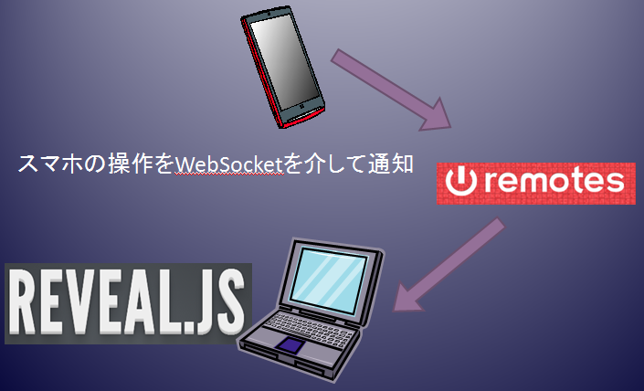
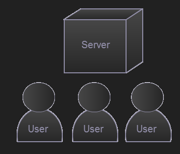

###Herokuで作る<br>WebSocketアプリケーション
####リアルタイムだけじゃないWebSocketの利点と課題
2014年6月9日  
株式会社 FLECT  
小西俊司
<iframe allowtransparency="true" frameborder="0" scrolling="no" style="width:130px; height:20px;" src="http://platform.twitter.com/widgets/tweet_button.html?url=http%3A%2F%2Fbit.ly%2F1kZfyuF&amp;text=Heroku%E3%81%A7%E4%BD%9C%E3%82%8BWebSocket%E3%82%A2%E3%83%97%E3%83%AA%E3%82%B1%E3%83%BC%E3%82%B7%E3%83%A7%E3%83%B3&amp;lang=ja&amp;count=horizontal"> </iframe>  
<iframe src="//www.facebook.com/plugins/like.php?href=http%3A%2F%2Fshunjikonishi.github.io%2Fslides%2Fwebsocket%2Findex.html&amp;width&amp;layout=standard&amp;action=like&amp;show_faces=true&amp;share=true&amp;height=80&amp;appId=336799126451529" scrolling="no" frameborder="0" style="border:none; overflow:hidden; height:80px;" allowTransparency="true"> </iframe>  


---
### Who?
- 氏名: 小西俊司
- 所属： [株式会社 FLECT](http://www.flect.co.jp/) クラウド事業部
  - [OSS Library](http://oss.flect.co.jp/)
- Twitter: [@shunjikonishi](https://twitter.com/shunjikonishi)
- GitHub: [shunjikonishi](https://github.com/shunjikonishi)

---
### Agenda
- WebSocketアプリサンプル
- WebSocketの通信パターン
- WebSocketとセキュリティ
- 切断のパターンと対処
- まとめ
  
---
### WebSocketアプリサンプル

---
### [お絵描きツール](http://shunjikonishi.github.io/room-sandbox/sample/canvas.html)
- ひとつのCanvasに皆でお絵描き
- MouseMoveでメッセージ送信
  - メッセージの連投に強いことがわかる

<div>
  <div>
    <canvas id="pad2" height="200"></canvas> 
  </div>
  <div>
    <button id="btnClear" class="btn">Clear canvas</button>
  </div>
</div>

<div class="alert alert-danger">
※スケールが変わるためこの画面ではマウスの位置と描画がずれることがあります。
</div>

-->
### こんなスライドも書きました

[一番簡単なWebSocketの試し方](https://www.slideshare.net/shunjikonishi/websocket-34998961)

<iframe src="http://www.slideshare.net/slideshow/embed_code/34998961" width="427" height="356" frameborder="0" marginwidth="0" marginheight="0" scrolling="no" style="border:1px solid #CCC; border-width:1px 1px 0; margin-bottom:5px; max-width: 100%;"> </iframe> 

---
### Quizar
- http://quizar.info/
- ルーム内に出題者と回答者がいるクイズゲーム
- *Ajaxを一切使っていない*

<iframe src="http://www.quizar.info/room/3/ranking" width="800" height="460" frameborder="1"></iframe>

-->
### 紹介ビデオ

<iframe src="//www.youtube.com/embed/tWoEzYr3rps" width="560" height="315" frameborder="0"></iframe>

---
### このプレゼン
- [REVEAL.js](http://lab.hakim.se/reveal-js/)と[remotes.io](http://remotes.io/)のコンボ
- Sender: スマホ。 スワイプ等のイベントを送信
- Receiver: PC。 イベントに反応してページをめくる



---
### ルームモデル
- WebSocketアプリの典型的なモデル
- 同じ部屋に複数のクライアントが存在して何らかのコラボレーションを行うモデル
- 各クライアントのロールは同じとは限らない


---
### WebSocket通信のパターン

---
### 例題
ロールが複数あるアプリのメッセージを考える

- クイズアプリで、
- 出題者、回答者、観覧者がいる状態で、
- 出題者が送信したメッセージを、
- (サーバが加工して)回答者、観覧者に異なるメッセージを送信する

<div class="padTop">
シーケンスを図示せよ
</div>

---
### 解答例
素直に書くと以下のようになる


<div class="padTop">
間違ってないが。。。
</div>

---
### 常に間にルームを置いて考える


-->
### ↑ の説明
- 前頁の「Server」という用語を「Handler」に変更
  - Httpリクエストでは共通のControllerがリクエストをうける(*コンビニレジ型*)
  - WSでは接続毎に個別のHandlerインスタンスを作成する(*専任担当者型*)
- Room概念の導入
  - 単純なメッセージブロードキャスト機構
  - ルーム内の他者にメッセージを送る場合は必ずブロードキャストする
  - ブロードキャストを受けたHandlerが接続先に何を返すか(あるいは無視するか)を判断する

---
### メリット1: スケールアウト
<div style="width:680px;height:480px;background-color:#212121;margin:10px auto;position:relative;">
  
  
  
  
</div>

-->
### ↑ の説明
- 接続数が増えた場合にサーバ台数を増やすことで対応可能となる
  - Herokuの場合はDyno数を増やすだけ
- ルーム機能はRedisのPub/Subをそのまま利用できる
- 逆にルーム概念が導入されていない場合に後からスケールアウトすることはほとんど不可能
  - 実際にはルーム毎にサーバを分けることが多い(ゲーム等)

---
### メリット2: シンプル
Roomの右側と左側のシーケンスを別に考えることができる

<div>
  
  
</div>

<div class="padTop">
</div>

- ロールが増えても常にシーケンスは上記のパターンのみ
- それぞれのメッセージ処理はHTTPで慣れ親しんだCall & Response型の処理とほぼ同じ

---
### Ajaxの代替としてのWebSocket
- デメリット
  - WebSocketの送受信メッセージには対応関係がないのでメッセージ内にIDを埋め込んで自分で対応関係を管理する必要がある
  - WebSocket非対応端末がある(IE9以前、Android 4.3以前の標準ブラウザ)
- メリット
  - 高速
  - セッション維持
  - ステートを維持した連続リクエストが可能(Ex. インクリメンタルサーチ)
  - *一度接続が確立したらそれ以降のリクエストは安全*

---
### WebSocketとセキュリティ

---
### 一般的なお話
- WebSocketには*Same Origin Policyがない*ためどこからでも繋がる
  - 接続時にOriginヘッダを検証すべき
- WebSocketリクエストにはCookieが付加される
  - Cookieのみを頼りにしたクライアント確認はCSRFと同じ原理の攻撃が可能
- 通信内容を保護したい場合はwssを使用する

---
### WebSocketとXSSの<br>コンボがやばすぎる件

``` javascript
//攻撃スクリプトの例
var ws = new WebSocket("ws://...");
ws.onmessage = function(event){
  //WebSocket経由でスクリプトを受信し
  //ajax通信を含む任意のスクリプトが実行できる!
  eval(event.data);
}
$.ajax = function(v) { 
  //jQueryのajaxメソッドを差し替えて
  //正規の通信を行いつつWebSocketにデータを横流し
  ...
}
```

XSS脆弱性はそもそも存在してはならないが、  
WebSocketがあることでリスク激増！

---
### ワンタイムトークンを使う


<ul class="padTop" style="width: 40%;">
  <li>考え方はCSRFと同じ</li>
  <li>CookieでSessionIdを管理</li>
  <li>トークンはMemcached等で管理</li>
  <li>WS接続確立時(onopenイベント)でトークンを検証</li>
  <li>*成功時はトークンを置き換え*(再接続時に使用)</li>
  <li>トークン検証までは他のリクエストは拒否</li>
</ul>

---
### ログインもWSで行うパターン


<ul class="padTop" style="width: 40%;">
  <li>SPAの場合はログインもWSでやるケースもある</li>
  <li>この場合も再接続に備えて認証後はトークンを返す</li>
  <li>Next Pageの送信はAjaxでも良いがWS接続が確立しているのでAjaxを使う理由はない</li>
</ul>

---
### JavaScript
*WebSocketのインスタンスは<br>
必ずローカル変数として生成する*
``` javascript
$(document).ready(function() {
  var ws = new WebSocket("wss://...");
  ...
});
```
- document#readyなどの関数内で生成
- クロージャ内のwsインスタンスに外部からアクセスする方法はない
  - ChromeのWebConsoleなどからもアクセス不可
- ワンタイムトークンの利用により新たな接続を確立することもできない

---
### Http vs. WebSocket
<em style="color:yellow">防御するポイントがまったく異なる</em>

- Http(REST)
  - public static
  - 全てのリクエストを検証することで安全を担保
- WebSocket
  - 接続はpublic、その後はprivate
  - *接続時の身元確認*と、
  - 接続インスタンスに*外部からアクセスさせない*ことで安全を担保
  - 認証後の個別リクエストの検証は重要ではない
    - お絵描きツールやゲームの弾幕処理等の多投型ではおそらく全くやってない

---
### 切断のパターンとその対処

---
### HerokuとWebSocket
WebSocketを使うためにはlabsコマンドで有効化が必要

``` bash
heroku labs:enable websockets -a xxxx
```

<div class="padTop">
<p><em class="fragment" data-fragment-index="3" style="color:yellow;">あくまで</em>WebSocket観点でHerokuの特徴をあげると。。。</p>
</div>

<ul>
  <li class="fragment" data-fragment-index="1">1日に1度Dyno再起動で接続が<em>切れる</em></li>
  <li class="fragment" data-fragment-index="1">接続確立後も無通信状態が55秒続くと<em>切れる</em></li>
  <li class="fragment" data-fragment-index="1">デプロイや環境変数の変更でもDynoが再起動して<em>切れる</em></li>
  <li class="fragment" data-fragment-index="2">スケールアウトが楽</li>
  <li class="fragment" data-fragment-index="2">Redisがプラグインで使える(試すだけなら無料)</li>
  <li class="fragment" data-fragment-index="3"><em style="color:yellow">運用面等Heroku本来のメリットは他にあります。</em></li>
</ul>

---
### クライアント側の切断要因
<ul>
  <li>ブラウザ(タブ)を閉じる</li>
  <li>スマホで長時間ブラウザをインアクティブにする</li>
  <li>通信環境不良／WiFiからの切断</li>
  <li>(ラップトップを含む)携帯端末のスリープ
</ul>

<div class="padTop fragment" data-fragment-index="1">
*AndroidとiOSで動作の傾向が異なる*
<div class="panel panel-success" style="float:left;width:45%;">
  <div class="panel-heading">Android</div>
  <div class="panel-body">
    <ul style="font-size:smaller;">
      <li>ブラウザを閉じてもすぐには切れない</li>
      <li>*スリープしても*かなり長時間切断されない</li>
    </ul>
  </div>
</div>
<div class="panel panel-info" style="float:right;width:45%;">
  <div class="panel-heading">iOS</div>
  <div class="panel-body">
    <ul style="font-size:smaller;">
      <li>ブラウザを閉じてもすぐには切れないが*イベントループも止まる*</li>
      <li>スリープは即切断</li>
    </ul>
  </div>
</div>

---
### デプロイ
- 近年アプリのリリース頻度は日に数回というレベルまである位に増える傾向
- よっぽど人気のないアプリでもない限りリリース時に接続ユーザがいないという状況は期待できない
  - リリースサイクルを分けるためにHttpサーバとWebSocketサーバを分離するという選択はあり得るがそれはまた別の話

<div class="padTop fragment">
  結局のところHerokuを使う、使わないに関わらず<br>*不測の切断に対する考慮は必要*
</div>


---
### 基本戦略
- 切断されたら再接続
  - WebSocket#oncloseイベントで再接続
  - 時間をおいて数回リトライする
  - 接続確立後はトークンを検証する
  - スマホで非アクティブの場合は再接続しない

---
### 無通信回避のための対処
- サーバまたはクライアントからポーリング
- サーバとクライアントのどちらから行うべきか？

<div class="padTop">
  <p>実験: setIntervalで100ms毎に処理を実行</p>
  <hr>
  <table>
    <tr><td>実行回数</td><td> - </td><td id="cntTimer" style="width:100px;"></td><td>回</td></tr>
    <tr><td>経過時間</td><td> - </td><td id="timeTimer" style="width:100px;"></td><td>秒</td></tr>
  </table>
  <button id="resetTimer" class="btn">リセット</button>
</div>

---
### ブラウザのsetTimeout(setInterval)
- 指定の時間に起動するというものではない
- ブラウザのタブがバックグラウンドに回るだけで後回しにされる
- インアクティブの時間が長いほど遅延時間が延びる気がするが定かではない

<div class="padTop">
<div class="panel panel-success" style="float:left;width:45%;">
  <div class="panel-heading">Android</div>
  <div class="panel-body">
    <ul style="font-size:smaller;">
      <li>スリープしてても実行されるが遅延が顕著</li>
      <li>30秒間隔としていても数分があくことも</li>
    </ul>
  </div>
</div>
<div class="panel panel-info" style="float:right;width:45%;">
  <div class="panel-heading">iOS</div>
  <div class="panel-body">
    <ul style="font-size:smaller;">
      <li>バックグラウンドでは実行されない</li>
    </ul>
  </div>
</div>

---
### サーバーからポーリングした場合
- PCブラウザは着信時にただちにイベント発生

<div class="padTop">
<div class="panel panel-success" style="float:left;width:45%;">
  <div class="panel-heading">Android</div>
  <div class="panel-body">
    <ul style="font-size:smaller;">
      <li>スリープしててもイベントを延々と処理し続ける</li>
      <li>数時間後に切れたりすることもあるが詳細は不明</li>
    </ul>
  </div>
</div>
<div class="panel panel-info" style="float:right;width:45%;">
  <div class="panel-heading">iOS</div>
  <div class="panel-body">
    <ul style="font-size:smaller;">
      <li>バックグラウンドではイベント処理されない</li>
      <li>キューにイベントが溜まっておりアクティブになった時にまとめて発生</li>
      <li>長期間放置していると接続切れる</li>
    </ul>
  </div>
</div>

-->
### さらに調べたい人は。。。
- このアプリをForkしよう
- http://flect-room-test.herokuapp.com/


*僕は挫折しました*

---
### 無通信対処の結論

<ul>
  <li class="fragment" data-fragment-index="1">*やらないのが一番いい*
    <ul>
      <li>1分近く無通信状態が続くのであれば再接続で十分</li>
    </ul>
  </li>
  <li class="fragment" data-fragment-index="2">もしやるのであれば。。。
    <ul>
      <li>アクティブ時のみクライアントからポーリング</li>
      <li>PC対象の場合はサーバからのポーリングもアリ</li>
    </ul>
  </li>
</ul>

---
### [PageVisibility API](https://developer.mozilla.org/ja/docs/Web/Guide/User_experience/Using_the_Page_Visibility_API)の利用

<table>
<tr><th>API</th><th>概要</th></tr>
<tr>
  <td>document<br>  #hidden</td>
  <td style="font-size:smaller">ブラウザ(タブ)が非表示であるかどうかを返す</td>
</tr>
<tr>
  <td>document<br>  #visibilitychange</td>
  <td style="font-size:smaller">
    ブラウザ(タブ)のアクティブ状態変更イベント<br>
    <span style="font-size:smaller">iOSでは発生しないため<br>window#pageshow/pagehide<br>で代替</span>
  </td>
</tr>
</table>

<div class="padTop">
 *特にAndroidでは*アクティブ状態による接続制御が必要
</div>


---
### まとめ
- *WebSocketは面白い*
  - WebSocketを扱うためのインフラは既に十分
  - ノウハウ、フレームワーク等はほとんどない
  - 発想次第で今までにないアプリが作れるかも
- Ajaxの代替としてWebSocketを使うのはアリ
  - ステート維持、privateな接続などは大きなメリット
  - サーバーサイドの実装が楽

-->
### おまけ
- [roomframework](https://github.com/shunjikonishi/roomframework)(jQuery plugin)
  - Ajaxライクな使用
  - トークン処理
  - 再接続
  - イベント登録
- [roomframework-play](https://github.com/shunjikonishi/roomframework-play)(Play2)
  - コマンドルーティング
  - ルームモデル

<div class="padTop">
などを*なんとなくいい感じに*処理してくれる<br>フレームワークを作ってます。
</div>

---
### 参考資料
- [WebSocketのバイナリメッセージを試したら、ウェブの未来が垣間見えた](http://blog.agektmr.com/2012/03/websocket.html)
- [Webアプリ開発者のためのHTML5セキュリティ入門](http://www.slideshare.net/muneakinishimura/webhtml5-31749532)
- [Cross-Site WebSocket Hijacking](http://www.christian-schneider.net/CrossSiteWebSocketHijacking.html)

---
### ご清聴ありがとうございました
